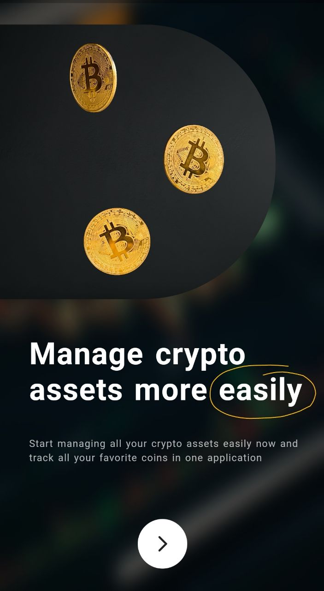
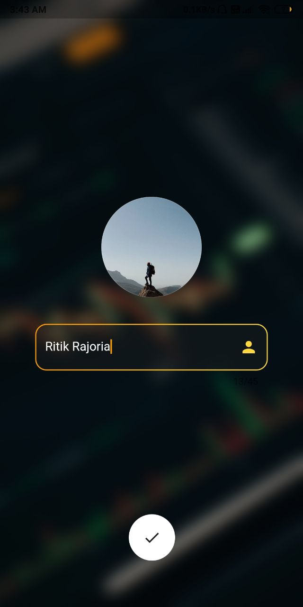
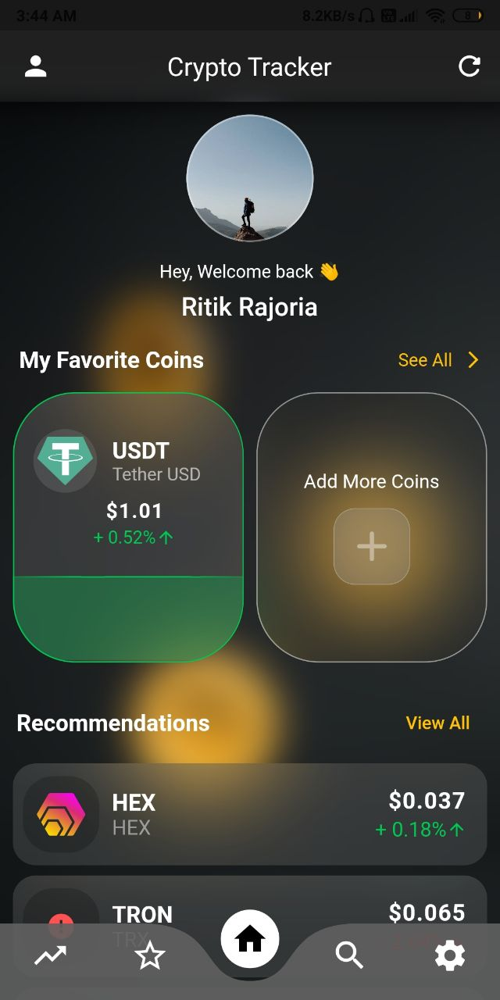
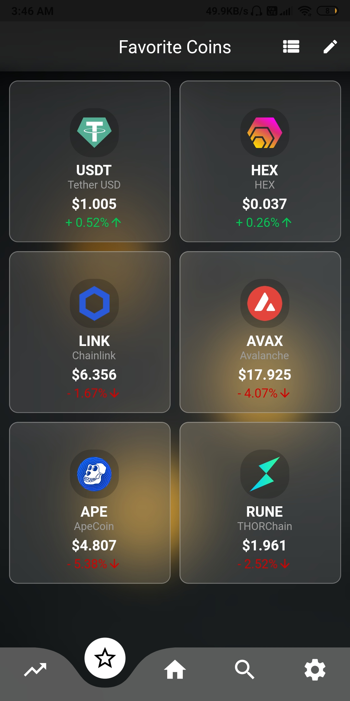
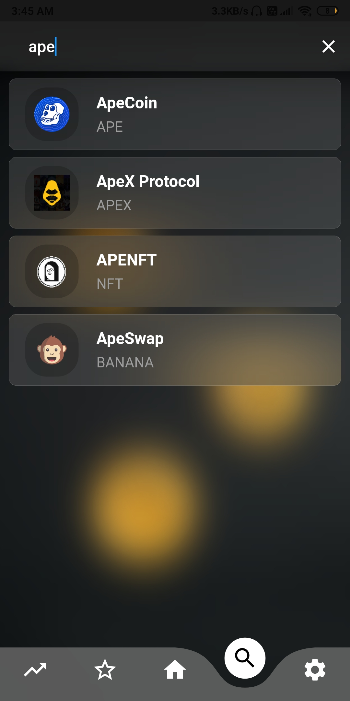
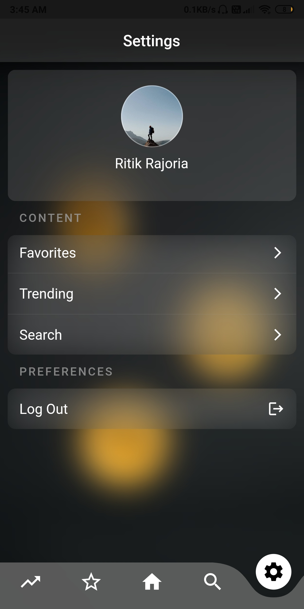
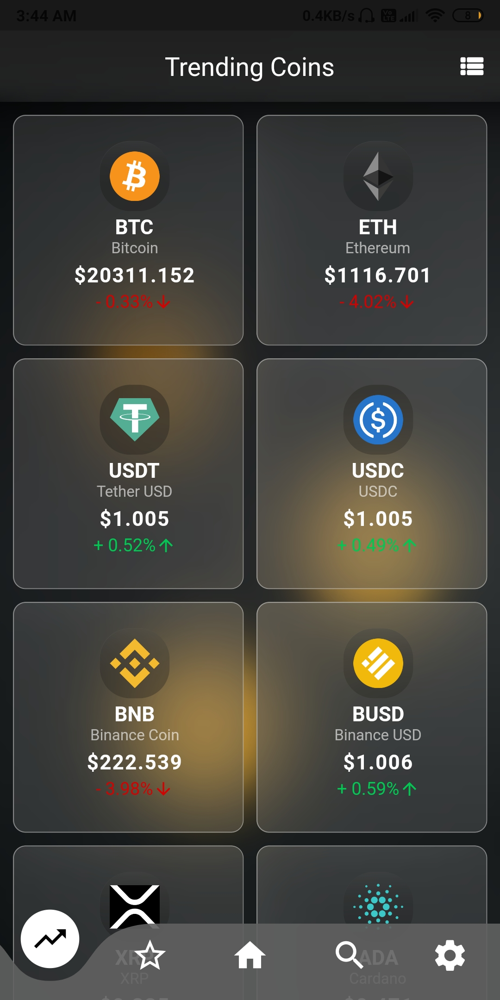
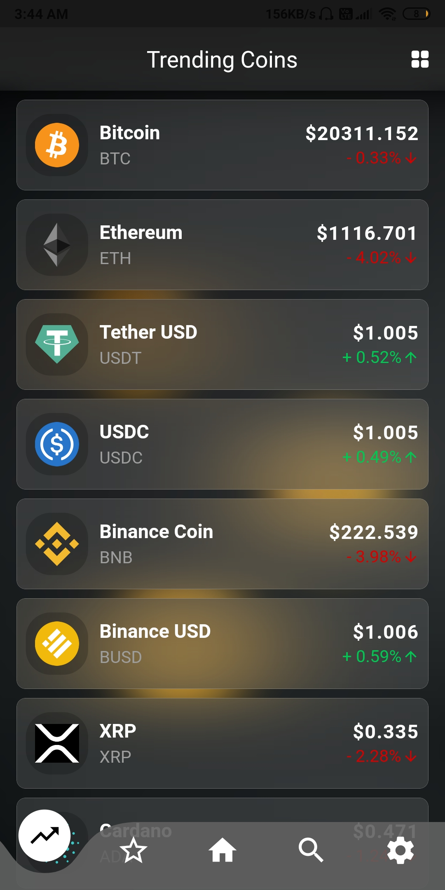

# Crypto Tracker

A Flutter application to track your favorite and trending crypto currencies.

 &nbsp;  &nbsp;  &nbsp;  &nbsp; &nbsp; 

**Two type of views**
- [x] Grid View 
- [x] List View
  
 &nbsp; 

### Prerequisites

**Flutter**

- [Flutter documentation](https://flutter.dev/docs)
- [Lab: Write your first Flutter app](https://flutter.dev/docs/get-started/codelab)
- [Cookbook: Useful Flutter samples](https://flutter.dev/docs/cookbook)

## About App

The app utilises [Coin Ranking API](https://developers.coinranking.com/api/documentation) and shows user details
about cryptocurrencies in the market, crypto coin history via
Charts, Lets users save their favourite coins and recommends
trending coins according to current market situations

## Supported Features

- :white_check_mark: Saving your favorites coin using sqflite.
- :white_check_mark: Live data changes.
- :white_check_mark: Glassmorphism Ui.
- :white_check_mark: Image picking as profile picture.
- :white_check_mark: Keeps u logged in.

## Packages in use

- curved_navigation_bar: ^1.0.3
- fl_chart: 0.45.0
- http: ^0.13.4
- flutter_bloc: ^8.0.1
- path_provider: ^2.0.9
- sqflite: ^2.0.2
- cached_network_image: ^3.2.0
- shared_preferences: ^2.0.13
- image_picker: ^0.8.5
- image_cropper: ^1.5.1
- gradient_borders: ^0.2.0
- intl: ^0.17.0

### Things i learned while making this project
- Complex UIs
- Sqflite (CRUD operations)
- Image picking and cropping
- Encoding image as String and vice versa.
- Using Rest APIs

## About the OpenStreetMap weather API

The app shows data from the following endpoints:

- [Coin Ranking API](https://developers.coinranking.com/api/documentation)

**Note**: This was my first project from scratch so a refactoring is needed due to the ugliness of the current code since my main purpose is/was to learn them at first.

